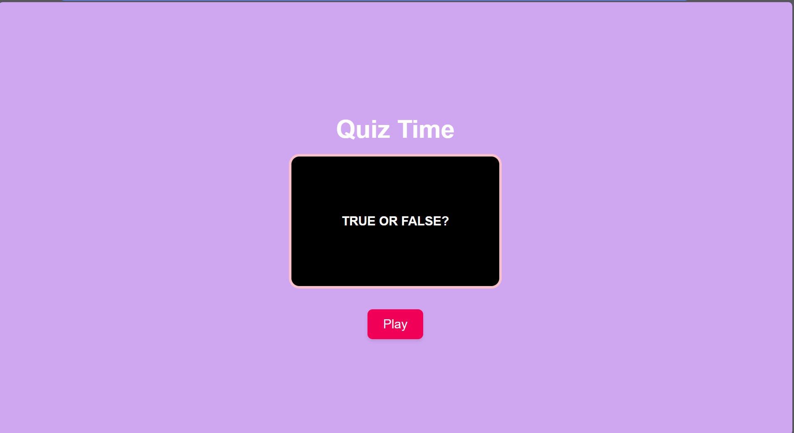
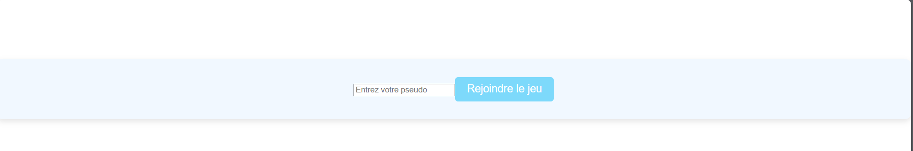

# 🎮 Quiz Game Realtime

Jeu questionnaire **multijoueur en temps réel** développé avec **React**, **Node.js/Express** et **Socket.IO**.  
Les joueurs rejoignent une partie avec un pseudonyme, répondent à des questions **Vrai/Faux**, et marquent des points selon la **rapidité** et l’**exactitude**. L’interface et les scores se synchronisent instantanément chez tous.

---

## 📸 Aperçu

<p align="center">
  <!-- Remplace par tes vraies images dans /images -->
  
  
  
</p>

---

## ✨ Fonctionnalités

- 👥 **Multijoueur** en temps réel (Socket.IO)
- 🧠 Questions **Vrai/Faux**
- ⚡ Points au **plus rapide** qui répond **correctement**
- 🕒 **Timer** par question (ex. 15 s)
- 🔄 gestion des déconnexions
- 🚪 Démarrage de la partie dès **≥ 2 joueurs**
- 📊 **Scores** mis à jour en direct

---

## 🧰 Stack

<p align="center">
  
  
  
  
</p>

> Optionnel : **MongoDB** (local ou Atlas) pour persister les joueurs/scores/historiques.

---

## 🗂️ Structure

```text
quiz-game-realtime/
├── socket-io-client/          # Frontend React
├── socket-io-server/          # Backend Node.js (Express + Socket.IO)
├── package.json
└── package-lock.json
```


---


